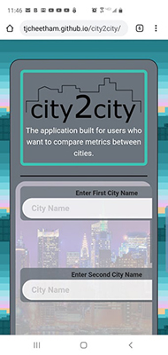
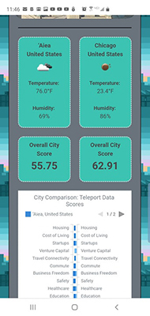
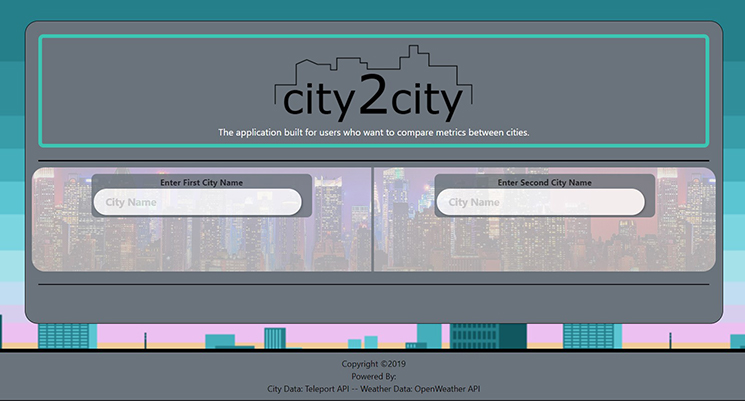
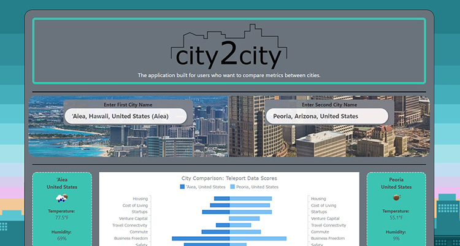

# city2city
​
### Table of Contents
- [Description](#Description)
- [Technologies-Libraries](#Technologies-Libraries)
- [Screenshots](#Screenshots)
- [Link](#Link)
​
### Description
Project #1 of the Boot Camp.This project is an introduction to working with a team and managing versions through GitHub.

This project is designed to compare data of 2 cities. Data like relative housing costs, quality of living commutes and more.
The API is full of data that we have just scratched the surface of. We are also using some local weather information from OpenWeatherMap. Part of our challenge is to use a new API, but also a new framework. We chose to use Bluma on this project.

​
### Technologies-Libraries
- [Bulma](https://bulma.io/) - CSS Framework
- [Teleport](https://developers.teleport.org/) - City Data API
- [Font Awesome](https://fontawesome.com/) - CSS Framework
- [Open Weather](https://openweathermap.org/current/) - Weather API
​
### Screenshots
​Phone Landing page ------------------- Phone Results page

                    
​

Desktop Landing page

​

Desktop Results page

​
### Link
Check it out! 
https://chrisneal72.github.io/Project_1/
